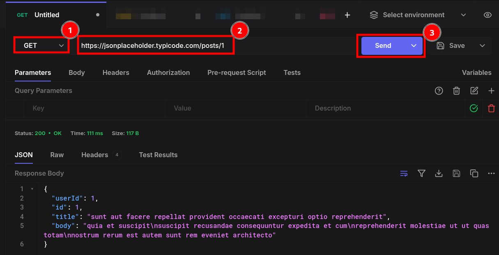
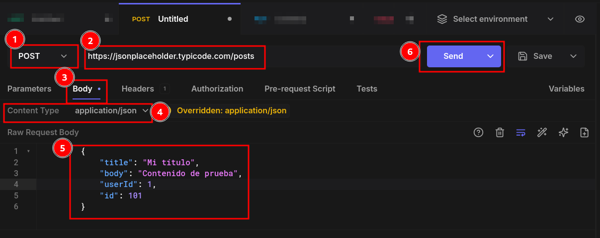
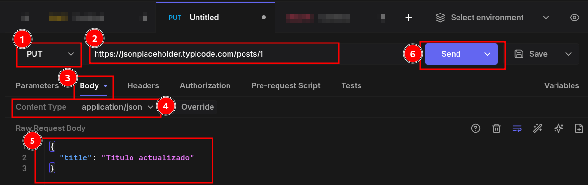
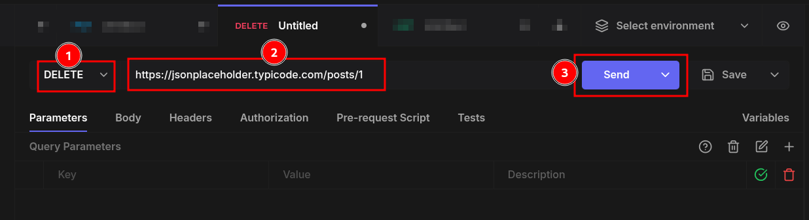

# Prueba REST

## jsonplaceholder
Permite probar GET, POST, PUT, DELETE, PATCH 
pero no persiste los datos solamente es para probar los envios y respuestas.

### Ejemplo Obtener 
|||
|-|-|
|Metodo| GET|
|URL| https://jsonplaceholder.typicode.com/posts/1|

### Ejemplo Crear
|||
|-|-|
|Metodo| POST|
|URL| https://jsonplaceholder.typicode.com/posts|
|Header|Content-Type: application/json|
|Body||  
        {
            "title": "Mi título",
            "body": "Contenido de prueba",
            "userId": 1,
            "id": 101
        } 

### Ejemplo Modificar
|||
|-|-|
|Metodo| PUT|
|URL| https://jsonplaceholder.typicode.com/posts|
|Header|Content-Type: application/json|
|Body||  
        {
            "title": "Título actualizado"
        }

### Ejemplo Eliminar
|||
|-|-|
|Metodo| DELETE|
|URL| https://jsonplaceholder.typicode.com/posts/1|

## restcountries

[restcountries.com](https://restcountries.com/#endpoints-latest-added-enpoint)

|||
|-|-|
|Metodo| GET|
|URL| https://restcountries.com/v3.1/name/bolivia |

